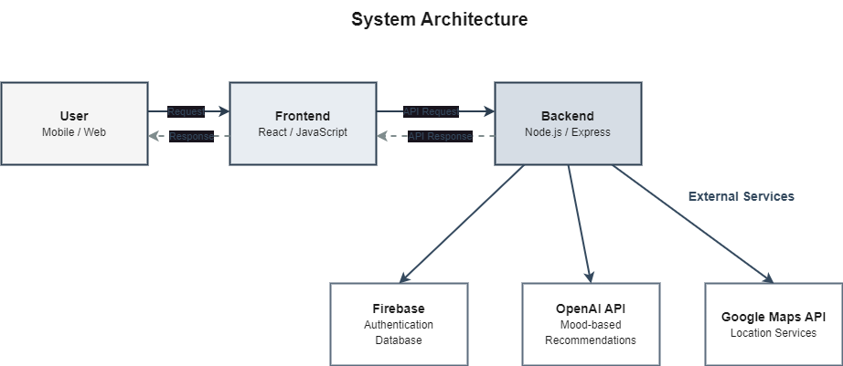

# 🧠 Capstone Proposal — Nexus

**Course:** Building AI-Powered Applications  
**Team Name:** Nexus  
**Project Title:** Smart Student Deals & Hangout Finder  
**Date:** October 24, 2025

## 1️⃣ Problem Statement

### The Problem

Many university students miss out on great deals and affordable hangout spots because student discounts and events are scattered across multiple platforms — bank websites (TBC, BOG), Telegram channels, university pages, or social media posts.

Students waste time switching between sources and often end up paying full price or missing events entirely. There's no unified platform aggregating verified student offers (bank cards, university partners, or brand campaigns) while also helping students discover places that match their budget and mood.

An AI-powered recommendation system can bridge this gap by analyzing mood, budget, and location to suggest personalized deals (e.g., cafés for studying, restaurants for hangouts, or gyms with student pricing).

### Scope

**In Scope:**
- Aggregation of verified student discounts and offers from banks (TBC, BOG) and partner programs
- Mood-based recommendations powered by AI (e.g., "relaxed," "social," "study")
- Search and map-based discovery of nearby offers
- Secure student login and verification via Firebase Auth

**Out of Scope (Future Work):**
- Partnerships or real-time bank integrations
- Custom ML model training (using pre-trained APIs only)
- Business analytics dashboards for merchants

**Why This Scope Makes Sense:**
It's achievable within one semester using free-tier APIs (OpenAI, Firebase, Google Maps). The focus stays student-centered without needing expensive infrastructure or data pipelines.

## 2️⃣ Target Users

### Primary Users

**User Type:** University and college students

**Demographics:**
- Age: 17–25
- Tech Level: Comfortable with mobile/web apps
- Context: Mobile use during commutes or social planning

**User Needs:**

| Need | Why It Matters | Current Workaround |
|------|----------------|-------------------|
| Find affordable hangouts easily | Saves money, increases social activity | Searching separate sites or asking friends |
| Discover new student deals quickly | Maximizes value from bank cards | Word-of-mouth or Instagram posts |
| Get personalized recommendations | Reduces decision fatigue | Browsing multiple apps manually |

**Pain Points:**
- Deals scattered across multiple sources
- Hard to verify expired or fake discounts
- No mood- or budget-based filtering

### Secondary Users
- Local businesses offering student discounts
- Student organizations promoting campus events

## 3️⃣ Success Criteria

### Product Success Metrics

| Metric | Target | Measurement |
|--------|--------|-------------|
| Number of verified deals | ≥ 40 at launch | Manual verification log |
| AI recommendation satisfaction | ≥ 70% "helpful" ratings | Post-test survey |
| App loading time | < 3 seconds | Performance test |
| User retention | ≥ 5 students returning weekly | Analytics tracking |
| Cost per user | <$0.10/session | API usage logs |

### Technical Success Criteria
- Response latency: <3s (p95)
- Availability: 95% uptime
- Error rate: <5%
- Cost per user: <$0.10 (via free-tier APIs)

### Learning Goals

| Team Member | Learning Focus |
|-------------|----------------|
| Gvantsa Nozadze (Frontend Lead) | Learn React Native UI, Firebase Auth integration |
| Tamar Vatcharadze (AI Lead) | Design lightweight AI recommendation logic, tune prompts |
| Davit Machitidze (Backend Lead) | Build Express.js API, connect Google Maps & Firebase with AI outputs |
## 4️⃣ Technical Architecture

### System Overview

The system aggregates verified student deals from banks and university sources, stores them in a cloud database, and uses an AI module to recommend hangouts based on mood and budget.

### Architecture Diagram

### Technology Stack

| Layer | Tools / Services |
|-------|------------------|
| Frontend | React Native (mobile) / React.js (web), TailwindCSS |
| Backend | Node.js + Express (hosted on Render free tier) |
| AI Module | OpenAI GPT-4o-mini / GPT-3.5-turbo for mood-based recommendations |
| Database | Firebase Realtime DB / MongoDB Atlas |
| Maps | Google Maps API (student free tier) |
| Hosting | Vercel / Expo |
| Testing & Monitoring | Jest, Firebase Console |

### Data Flow (Simplified)

1. User logs in and selects mood + budget
2. App fetches verified deals from database
3. Backend filters deals by location and type
4. AI module ranks top 3 matches
5. Results shown in list + map view

**🕒 Latency Target:** <4s end-to-end

## 5️⃣ Risk Assessment

| Risk | Likelihood | Impact | Mitigation |
|------|------------|--------|------------|
| API rate limits (Google/OpenAI) | Medium | Medium | Use caching + API key rotation |
| AI inaccuracy | Medium | Medium | Gather feedback and adjust prompts |
| Limited deal data | Medium | High | Use bank + campus public offers initially |
| Low user engagement | Medium | High | Conduct early feedback testing |
| Scope creep | Medium | Medium | Weekly scope reviews + feature freeze after Week 8 |
| Unequal workload | Low | Medium | Weekly check-ins + GitHub tracking |
| Team absence | Low | High | Cross-train and document processes |
| Prompt injection / bias | Low | Medium | Sanitize inputs + test across moods |
| Privacy risk | Low | High | No PII collection, anonymized logs |

### Contingency Plans
- If OpenAI API fails → fallback to keyword-based filtering
- If few users → simulate data with personas
- If delayed → drop mood visualizer, keep core deal system

## 6️⃣ Research Plan

### Key Research Goals
- Fetching and structuring public deal data (Week 3–4)
- Mood classification impact on discovery (Week 5–6)
- Gen-Z interaction patterns with recommendations (Week 7–8)

### Experiments & Timeline

| Weeks | Focus | Deliverable |
|-------|-------|------------|
| 3–4 | Fetch + display 10 sample deals | Prototype |
| 5–6 | Implement mood-based AI module | Working logic |
| 7–8 | User test + gather feedback | Survey data |
| 11–12 | Optimize cost + latency | Improved MVP |

### Key References:
- OpenAI Cookbook
- Firebase Auth Guide
- Google Maps API Docs

## 7️⃣ User Study Plan

**Purpose:** Evaluate how effectively the app recommends relevant deals and hangouts.  
**Participants:** 10–15 students (ages 18–24)

### Process:
1. Use app for 10 minutes
2. Fill a short satisfaction survey
3. Analyze usability patterns

### Ethics:
- No sensitive data collected. Anonymous feedback only.
- Covered under IRB Light Checklist — no full IRB required.

### Recruitment:
KIU student groups + Telegram channels  
**Compensation:** Optional shout-outs or small digital gift cards

## 8️⃣ Project Timeline & Milestones

| Week | Focus | Deliverables | Owner |
|------|-------|--------------|-------|
| 1 | Setup | Repo + team setup | All |
| 2 | Planning | Proposal submission | All |
| 3 | Core Flow | Display deals from DB | All |
| 4 | Design Review | Architecture + evaluation plan | All |
| 5 | AI Integration | Mood-based logic | All |
| 6 | Frontend Polish | UI + UX fixes | All |
| 7 | User Testing | Feedback round 1 | All |
| 8 | Iteration | Fix + optimize | All |
| 10 | Optimization | Cost + latency tuning | All |
| 11 | Safety Audit | Bias + privacy tests | All |
| 14 | Final Testing | Demo-ready MVP | All |
| 15 | Final Demo | Presentation + video | All |

### Backup Plan:
- Drop mood visualizer if delayed
- Maintain essential flows (login + map + AI deals)

## 9️⃣ Budget & Resources

| Item | Source | Cost |
|------|--------|------|
| OpenAI API | Free tier (GPT-3.5-Turbo) | $0 |
| Firebase + Google Maps | Free quotas | $0 |
| Hosting (Vercel / Render) | Free tier | $0 |
| **Total Project Cost** | | **$0** |

### Resources:
- Personal laptops
- API access through individual free accounts
- **Estimated effort:** 12 weeks × 3 members = ~360 total hours

## 🔟 Appendix

### Team Contract Summary:
All members contribute equally, meet weekly, and document commits.  
**Full version:** [docs/Team-Contract.md](Team-Contract.md)

### References:
- OpenAI Docs (2025)
- Firebase Realtime Database
- Google Maps API Developer Guide
- LangChain Blog — Lightweight Recommendation Logic